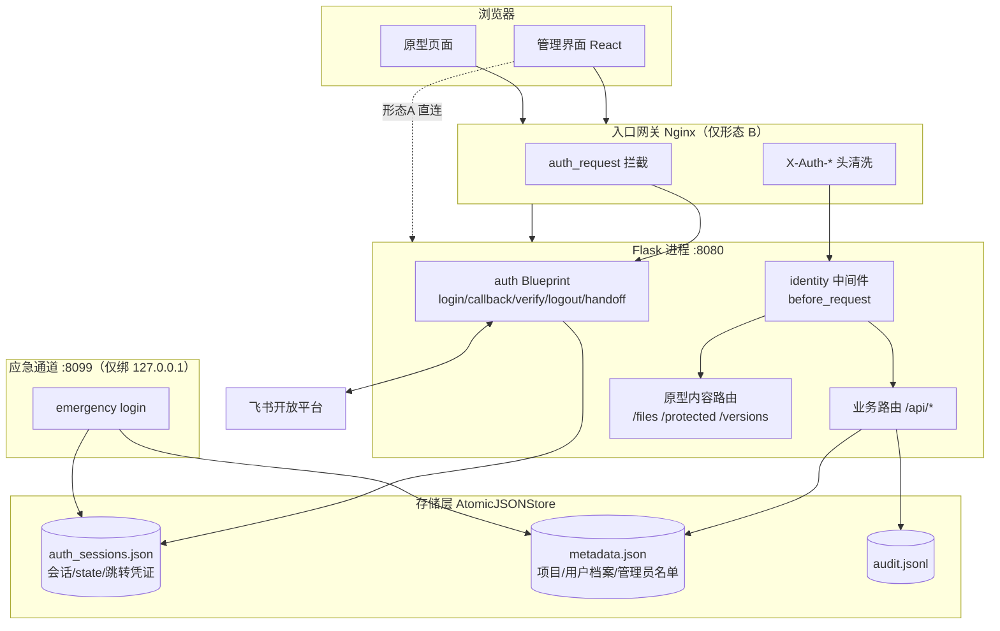
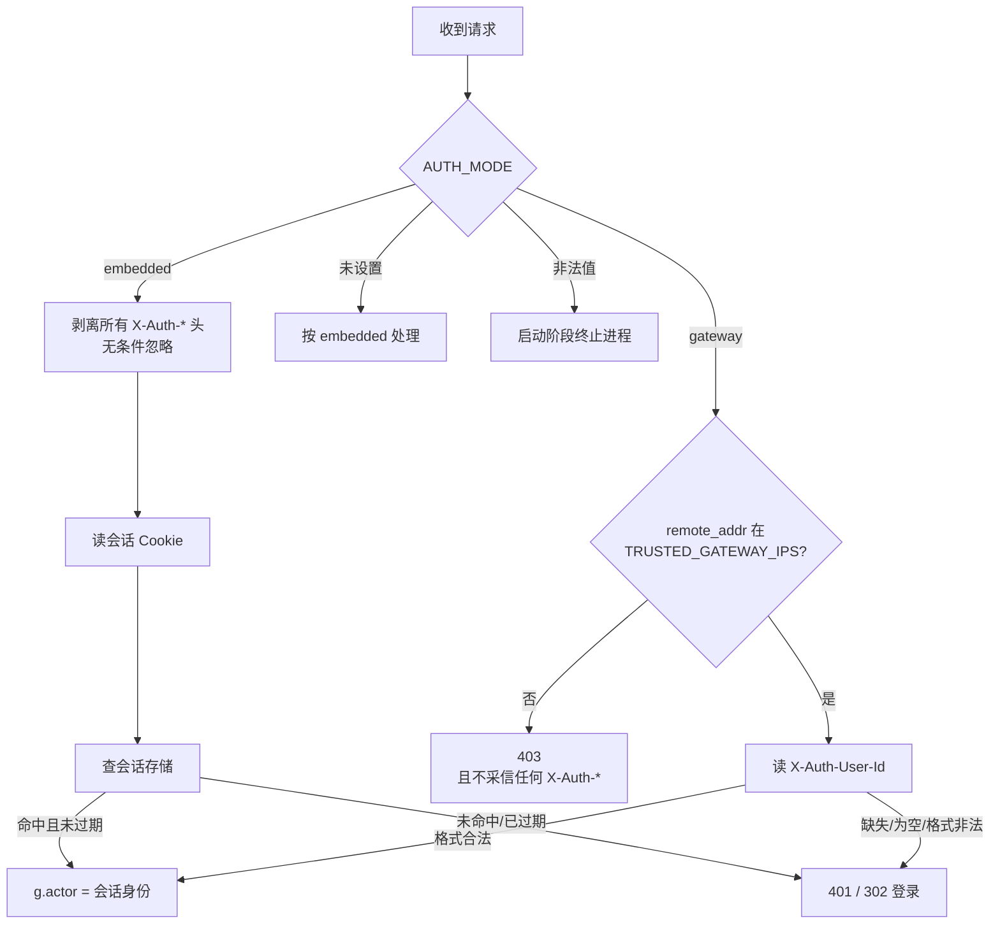
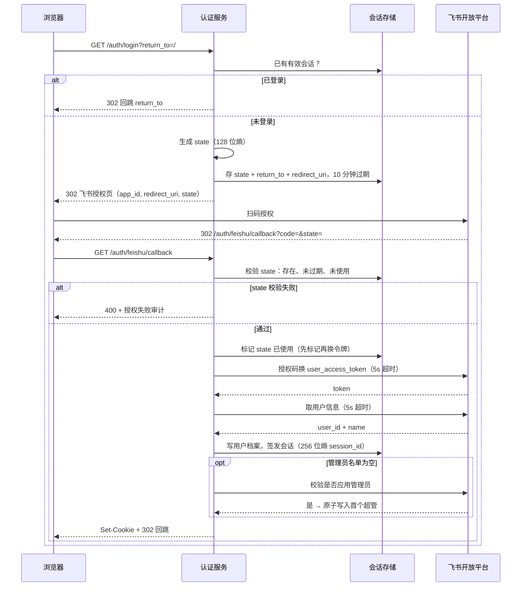
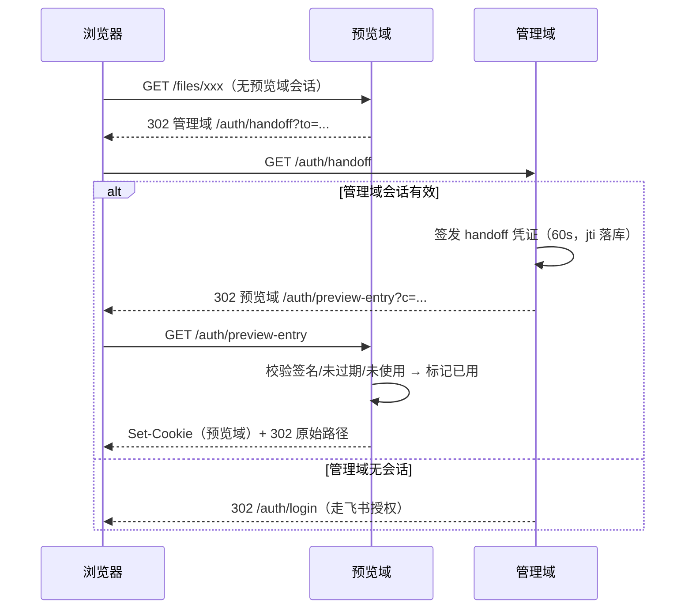

# Design Document

> 飞书扫码登录（SSO）与身份/所有权模型改造 —— 技术设计

## Overview

本设计把平台的身份体系从「用户名密码 + IP 所有权」切换为「飞书 SSO + 飞书 UserID 所有权」，并为公网部署建立认证边界。

设计的核心难点不是飞书 OAuth 对接（流程标准、约 300 行），而是**同一套代码要同时在两种部署形态下正确且安全地工作**：

| | 形态 A：单进程（开发期，现在就要能跑） | 形态 B：网关（生产） |
|---|---|---|
| 拓扑 | 一个 Flask 进程监听 `0.0.0.0:8080` | Nginx 唯一入口 + `auth_request` + Flask 后端 |
| 域名 | 无，`localhost` / `10.10.1.25` | 管理域 `app.<域名>` + 预览域 `preview.<域名>` |
| 传输 | HTTP | HTTPS |
| 身份来源 | 直接解析会话 Cookie | Nginx 注入的 `X-Auth-User-*` 头 |
| 飞书回调 | 已配置且可用，本人已是测试人员 | 待域名就绪后新增 |

形态 A 现在就能用真实飞书账号跑通完整链路，这是本阶段唯一的验证途径，因此设计必须保证它一等公民地可用，而不是"生产方案的降级版"。

### 贯穿全局的安全不变式

**任何情况下，客户端传入的 `X-Auth-*` 请求头都不得影响身份判定。**

这是从现有 `get_client_ip()` 无条件信任 `X-Forwarded-For` 这个漏洞里得到的教训。两种形态用两条独立的机制保证：形态 A 完全忽略并剥离这类头；形态 B 先校验请求来源是否为可信网关，再采信。配置缺失或非法时启动失败（fail-closed），绝不退化成"采信头"。

## Architecture

### 组件划分

认证服务作为 **Flask Blueprint** 挂载到现有 `create_app()` 上，不拆独立进程。理由：形态 A 下本来就是一个进程；形态 B 下 Nginx 的 `auth_request` 子请求打到同一个后端的 `/auth/verify` 端点即可，无需额外进程和端口。应急管理员通道是唯一的例外，它必须独占一个只绑回环的套接字。



### 身份解析：三层分离

把「身份的真相」和「身份的传输」分开，是同时满足两种形态的关键。

1. **真相层**：会话 Cookie → `auth_sessions.json` → UserID。认证服务内部一切以此为准。
2. **传输层**：`X-Auth-User-Id` / `X-Auth-User-Name` 头**仅**用于「网关与业务应用是不同进程」时把已校验的身份传过去。它不是身份的来源，只是搬运工。
3. **模式开关**：环境变量 `AUTH_MODE`，取值 `embedded`（默认）或 `gateway`。



`AUTH_MODE` 取非法值时在启动阶段就终止，不进入运行；未设置时按最安全的 `embedded` 处理。这样"配置写错"的后果是"大家登不进去"，而不是"任何人都能冒充任意员工"。

_满足需求：2.7、2.9、2.12、2.13、2.15_

### 形态 A 下预览域隔离的降级方案

需求 4 的域名隔离在形态 A 下无法实现——只有一个 origin。这里必须诚实地承认能力边界：

- **需求 4 的全部验收条件延后到形态 B**，不在本阶段声称达成。
- 形态 A 下提供一个缓解措施：对 `/files/*`、`/protected/*`、`/versions/*` 的响应加 `Content-Security-Policy: sandbox allow-scripts allow-forms allow-popups`。`sandbox` 不带 `allow-same-origin` 会把原型页面放进一个独立的不透明源，它读不到管理界面的 Cookie 和 localStorage，发往同源的 fetch 也会变成不带凭据的跨源请求。
- **这个缓解有副作用**：依赖 `localStorage`、`sessionStorage` 或同源 fetch 的原型会失效。开关由 `PREVIEW_SANDBOX`（默认开）控制，遇到坏掉的原型可以临时关掉，但关掉就等于恢复到当前的风险水平。
- 形态 B 下不需要这个开关，域名隔离是更彻底的解法。

_满足需求：4（形态 B）；4 的形态 A 降级说明_

## Components and Interfaces

### 新增模块

| 文件 | 职责 |
|---|---|
| `server/auth/__init__.py` | Blueprint 工厂，注册所有 `/auth/*` 路由 |
| `server/auth/feishu.py` | 飞书开放平台客户端（`urllib` 实现，无第三方依赖） |
| `server/auth/session_store.py` | 会话、`state`、跳转凭证的持久化（包 `AtomicJSONStore`） |
| `server/auth/identity.py` | `before_request` 身份解析中间件，两形态分支 |
| `server/auth/signing.py` | HMAC-SHA256 签名凭证的签发与校验 |
| `server/auth/emergency.py` | 应急管理员通道（独立回环套接字） |
| `server/permissions.py` | `can_manage()` 与角色判定，替代 `can_delete()` |
| `server/user_directory.py` | 用户档案与管理员名单的读写 |
| `server/migrate_identity.py` | 一次性迁移脚本（幂等） |
| `deploy/nginx.conf.example` | 形态 B 的网关配置样例 |
| `.env.example` | 环境变量样例（占位符） |

### 飞书客户端接口

```python
# server/auth/feishu.py
class FeishuError(Exception):
    """含飞书 code 与 msg，绝不携带 App Secret 或 access_token。"""
    code: int
    msg: str

def exchange_user_token(code: str, redirect_uri: str) -> str: ...
    """授权码换 user_access_token。超时 5 秒，不重试。"""

def get_user_info(user_access_token: str) -> dict:
    """返回 {"user_id": str, "name": str}。超时 5 秒，不重试。"""

def is_app_admin(user_access_token: str, user_id: str) -> bool:
    """校验是否为飞书应用管理员，仅在管理员名单为空时调用。"""
```

统一走一个内部 `_post_json()` / `_get_json()`，用 `urllib.request` + `ssl.create_default_context()` 保证证书校验，`timeout=5`。所有异常收敛成 `FeishuError`，异常信息里只放飞书返回的 code 与 msg。

_满足需求：1.3、1.6、1.11、1.12、8.2、12.5、12.7、13.1、13.5_

### 认证路由

| 方法 | 路径 | 说明 | 形态 |
|---|---|---|---|
| GET | `/auth/login` | 已登录则直接回跳，未登录则 302 到飞书授权页 | A + B |
| GET | `/auth/feishu/callback` | 校验 `state`、换令牌、取用户信息、签发会话、回跳 | A + B |
| POST | `/auth/logout` | 删除当前域会话，返回失效 Cookie | A + B |
| GET | `/auth/verify` | `auth_request` 校验端点，200 时回 `X-Auth-User-*` 响应头 | B |
| GET | `/auth/handoff` | 管理域签发一次性跳转凭证，302 到预览域 | B |
| GET | `/auth/preview-entry` | 预览域消费跳转凭证，签发预览域会话 | B |
| GET | `/auth/health` | 健康检查，排除在 `auth_request` 之外 | A + B |

### 业务接口变更

| 方法 | 路径 | 变更 |
|---|---|---|
| GET | `/api/me` | **新增**：当前用户 UserID、姓名、是否管理员/超管 |
| GET | `/api/users` | **新增**：用户档案列表，供「指定负责人」「添加管理员」选人 |
| POST | `/api/projects/owner` | **新增**：批量指定负责人（超管） |
| GET | `/api/admins` | **改造**：返回以 UserID 为主键的管理员名单 |
| POST | `/api/admins` | **改造**：从用户档案添加普通管理员 |
| DELETE | `/api/admins/<user_id>` | **改造**：按 UserID 移除 |
| GET | `/api/files` | 每个条目 `canDelete` → `canManage`，新增 `ownerId`/`ownerName`，`url` 改为预览域绝对 URL |
| GET | `/api/logs` | 新增 `actor_id` 筛选参数 |
| — | `/api/admin/login`、`/api/admin/logout`、`/api/admin/setup`、`/api/admin/status`、`/api/admin/password` | **移除**（能力迁移到 `/auth/*` 与应急通道） |

### 权限判定

```python
# server/permissions.py
@dataclass(frozen=True)
class Actor:
    user_id: str
    name: str
    is_admin: bool
    is_super: bool
    source: str          # "feishu" | "emergency"

def can_manage(project_meta: dict | None, actor: Actor) -> bool:
    if actor.is_admin:                      # 超管与普通管理员一视同仁
        return True
    owner_id = (project_meta or {}).get("owner_id") or ""
    if not owner_id:                        # 无负责人：非管理员一律为假
        return False
    return owner_id == actor.user_id
```

`uploader_ip` 完全不出现在这个函数里，从结构上保证它不参与权限判定。

**`file_manager` 的接口同步简化**：`delete_file(key, request_ip, is_admin)` 改为 `delete_file(key, allowed: bool, actor: Actor)`，权限在路由层算好后以布尔值传入，文件操作层不再自己判权。`restore_version_file`、`delete_version_file` 同样处理，`can_delete()` 删除。这样"漏判权限"会变成显式的参数缺失而不是静默放行。

_满足需求：5.6、5.8、7.1、7.2、7.3、7.4、7.10_

## Data Models

### 会话存储 `auth_sessions.json`

复用 `AtomicJSONStore`，不引入 SQLite。

```json
{
  "sessions": {
    "<session_id>": {
      "user_id": "ou_xxx",
      "name": "谢勇华",
      "domain": "admin",
      "kind": "feishu",
      "created_at": 1785000000,
      "last_seen_at": 1785000300,
      "expires_at": 1787592000
    }
  },
  "states": {
    "<state>": { "return_to": "/", "redirect_uri": "http://localhost:8080/auth/feishu/callback",
                 "expires_at": 1785000600, "used": false }
  },
  "handoffs": {
    "<jti>": { "user_id": "ou_xxx", "expires_at": 1785000060, "used": false }
  }
}
```

- 时间统一 UTC 秒级整数。`expires_at = created_at + 2592000`。
- `domain` 取 `"admin"` / `"preview"`；`kind` 取 `"feishu"` / `"emergency"`。
- 每次变更走 `transaction()`，天然满足"原子写入 + 跨进程锁 + 崩溃后文件完整"。
- **写放大控制**：活跃时间 5 分钟节流（需求 3.6/3.7）后，正常使用下每个用户每 5 分钟最多一次落盘。按几十人规模，文件保持在几十 KB，全量重写成本可忽略。这是本设计接受的容量上界；若将来用户数到数百人，需要换成 SQLite。
- 启动时清理过期记录并保留备份（`AtomicJSONStore.save()` 自带备份）。

_满足需求：3.1、3.2、3.3、3.14、3.15_

### `metadata.json` 结构变更

项目条目新增两个字段，版本记录也带上，`uploader_ip` 原样保留：

```json
{
  "file:example.html": {
    "title": "示例",
    "owner_id": "ou_xxx",
    "owner_name": "谢勇华",
    "uploader_ip": "10.6.29.184",
    "current_version": "V2",
    "versions": {
      "V1": { "upload_time": "...", "uploader_ip": "...", "owner_id": "", "owner_name": "" },
      "V2": { "upload_time": "...", "uploader_ip": "...", "owner_id": "ou_xxx", "owner_name": "谢勇华" }
    }
  },
  "_system_users_": {
    "ou_xxx": { "name": "谢勇华", "first_login_at": "...", "last_login_at": "..." }
  },
  "_system_admin_list_": {
    "ou_xxx": { "name": "谢勇华", "level": "super", "created_at": "..." }
  },
  "_system_admins_": { "users": [ { "username": "...", "password_hash": "$2b$..." } ] }
}
```

用户档案与管理员名单放进 `metadata.json` 而不是独立文件：项目列表接口本来就要加载它，同一次 `load()` 就能拿到负责人姓名，省掉一次文件读取。会话数据则**不能**放这里——它写得太频繁，会把项目元数据卷进无谓的备份轮转。

**关于需求 5.11**：该条要求"用户档案查询超过 2 秒未返回则降级到 `owner_name` 快照"。本设计下用户档案是同一份内存字典里的查找，不存在网络调用和超时，该条自然满足。降级到快照的逻辑仍然实现——用于 `owner_id` 在档案中查不到的情况（需求 5.10），这是真实会发生的（员工离职后档案被清理，或迁移期手工指定了未登录过的 UserID）。

`_system_admins_` 保留原结构不动，用途收窄为应急通道，飞书登录路径完全不读它。

_满足需求：5.1、5.3、5.5、5.7、5.9、5.10、5.11、8.1、8.14_

### 签名凭证

不引入 JWT 库，用标准库实现最小可用形态：

```
credential = b64u(json(payload)) + "." + b64u(hmac_sha256(secret, b64u(payload)))
```

`payload` 含 `typ`（`handoff` / `access`）、`sub`（UserID）、`exp`、以及类型相关字段。校验用 `hmac.compare_digest()` 防时序攻击。

- **跳转凭证**（`typ=handoff`）：60 秒有效，且 `jti` 落库标记一次性。签名本身无法保证"用过就失效"，必须有服务端状态，这是需求 4.9 的硬要求。
- **访问凭证**（`typ=access`）：8 小时有效，不落库（需求 14.6 明确要求无状态）。payload 含 `sub`、`key`（项目标识）、`pv`（密码版本）、`exp`。

**需求 14.9「密码改了旧凭证立即失效」在无状态前提下怎么做**：`pv` 取该项目当前 bcrypt 哈希的前 12 个字符。密码一改，哈希变了，`pv` 对不上，旧凭证在下一次校验时即失效。不需要额外存储，也不泄露哈希（bcrypt 前缀含算法与 salt 片段，无法反推密码）。

签名密钥来自 `AUTH_SIGNING_SECRET`。未设置时：`embedded` 模式自动生成 32 字节随机值持久化到 `BASE_DIR/.auth_secret`（权限 0600，加入 `.gitignore`），保证重启后已签发凭证仍有效；`gateway` 模式下必须显式提供，缺失则启动终止。

_满足需求：4.8、4.9、4.10、14.2、14.6、14.9_

## 关键流程

### 飞书扫码登录时序



先标记 `state` 已使用再去换令牌，避免并发重放。`state` 校验的四种失败（缺失、无记录、已过期、已使用）都走同一个 400 分支。

_满足需求：1.1~1.15、8.2、8.3、8.4_

### 形态 B 的预览域跳转



### 存量项目负责人指定

超管在界面上勾选「未指定负责人」筛选出的项目，选一个人，批量提交。校验顺序固定为 权限(403) → 参数(400) → 项目存在性(404)，全有或全无地写入。

## 迁移设计

`server/migrate_identity.py`，可重复执行：

1. 备份 `metadata.json`（`AtomicJSONStore.save()` 自动做，脚本再显式留一份带时间戳的副本）。
2. 在一次 `transaction()` 里遍历所有 `file:` 条目：`owner_id` / `owner_name` 缺失则补空字符串；**已有非空值不覆盖**（幂等的关键）。
3. 版本记录同样补齐两个字段为空字符串，`uploader_ip` 一个不动。
4. 建立 `_system_users_` 与 `_system_admin_list_` 两个空容器（若不存在）。
5. 输出报告：项目总数、待指定负责人数量、版本记录处理数。
6. 任何异常 → `transaction()` 不提交，文件保持原内容。

预期在生产上的输出：41 个项目全部待指定负责人，67 个归档的 `uploader_ip` 原样保留。

_满足需求：5.12~5.16_

## 应急管理员通道

需求 9.1 要求"仅将监听套接字绑定到回环地址，使非本机连接无法建立"，这必须是一个独立套接字，靠 `remote_addr` 判断不满足字面要求。

设计：在主进程内用后台线程起一个独立的 werkzeug 服务实例，绑定 `EMERGENCY_BIND`（默认 `127.0.0.1:8099`）。

- **启动前校验**：解析 `EMERGENCY_BIND` 的地址部分，不是 `127.0.0.1` / `::1` / `localhost` 就**拒绝启动整个进程**并打印违规说明。这条比"运行时拒绝请求"更强，配置写错不可能上线。
- **双保险**：请求进来再查一次 `remote_addr` 是否回环，不是则 403 + 审计。
- 签发 `kind=emergency` 的会话，60 分钟固定有效期，`last_seen_at` 不续期。
- 密码策略：16~128 字符、四类字符里至少三类，bcrypt 存储，沿用现有 `_system_admins_`。
- 失败限流：15 分钟滑动窗口 5 次 → 429 持续 15 分钟，成功后归零。计数放会话存储的独立键，重启不丢。
- 形态 B 下 Nginx 根本不代理 8099，端口不对外。

_满足需求：9.1~9.12_

## Nginx 配置要点（形态 B 交付物）

`deploy/nginx.conf.example` 需体现：

```nginx
# 身份头清洗：必须在任何 proxy_pass 之前，且覆盖下划线变体
proxy_set_header X-Auth-User-Id "";
proxy_set_header X-Auth-User-Name "";
underscores_in_headers off;   # 使 X_Auth_* 不被转成 X-Auth-*

location = /auth/verify {
    internal;
    proxy_pass http://backend;
    proxy_pass_request_body off;
    proxy_set_header Content-Length "";
}

# 管理域
server {
    server_name app.<域名>;
    auth_request /auth/verify;
    auth_request_set $auth_user_id   $upstream_http_x_auth_user_id;
    auth_request_set $auth_user_name $upstream_http_x_auth_user_name;
    location / {
        proxy_set_header X-Auth-User-Id   $auth_user_id;
        proxy_set_header X-Auth-User-Name $auth_user_name;
        proxy_pass http://backend;
    }
    location ~ ^/(files|versions|protected)/ { return 404; }   # 原型内容不在管理域
    error_page 401 = @login_or_401;
}

# 预览域
server {
    server_name preview.<域名>;
    auth_request /auth/verify;
    add_header X-Content-Type-Options nosniff always;
    if ($request_method !~ ^(GET|HEAD)$) { return 405; }
    location ^~ /api/ { return 403; }
    location ~ ^/(files|versions|protected|auth)/ { proxy_pass http://backend; }
    location / { return 404; }
}
```

`auth_request` 子请求超时 2 秒、非 200/401 一律 503（fail-closed）通过 `proxy_read_timeout` 与 `error_page` 实现。

_满足需求：2.1~2.8、2.11、4.1~4.5、4.13_

## Error Handling

| 场景 | 行为 | 需求 |
|---|---|---|
| `state` 缺失/无记录/过期/已用 | 400 + 授权失败审计，不签发会话 | 1.4 |
| 回调缺授权码 | 400 + 审计 | 1.13 |
| 飞书超时（5s） | 错误页含「重新发起授权」，不重试 | 13.1 |
| 飞书返回 code 无效/已用 | 错误页含「重新登录」，保留原有会话 Cookie | 13.4 |
| 用户信息接口失败或 UserID 为空 | 终止登录，不写档案不签发会话 | 1.14 |
| 会话空闲 > 7 天 / 超绝对 30 天 | 删记录 + 401 + 失效 Cookie；等于阈值算未过期 | 3.8、3.9 |
| 会话存储文件损坏 | 从备份恢复 → 无备份则空集合启动 + 审计，不终止 | 3.15 |
| 会话所属域与请求域不符 | 401，不刷新活跃时间 | 4.11 |
| `gateway` 模式下来源非可信网关 | 403，不采信任何 `X-Auth-*` | 2.9 |
| 身份头缺失/为空/格式非法 | 401 + 需重新登录指示，不执行写操作 | 2.13 |
| 姓名解码失败 | 回退用 UserID 展示，不阻断请求 | 2.14 |
| `canManage` 为假 | 403，元数据/当前版本/归档均保持原状 | 7.5 |
| 项目密码错误 | 401 + 审计；15 分钟 5 次 → 429 | 14.7、14.8 |
| 审计写入失败 | 业务操作照常返回成功，不中断请求 | 10.11 |
| `AUTH_MODE` 非法 / Secret 缺失 / 应急通道绑非回环 | 启动阶段终止进程 | 9.10、12.2 |

错误页统一走一个 `_error_page(title, detail, action)` 模板，不回显飞书原始响应，不暴露应急通道路径（需求 13.6）。

## Correctness Properties

以下是必须恒成立的性质，适合用属性测试（对随机输入反复验证）而不是单点用例来覆盖。它们是本设计的安全与正确性底线。

### Property 1: 伪造身份头无效

对任意请求头集合 H 与任意会话状态 S，身份解析结果在 `embedded` 模式下只由 S 决定，在 `gateway` 模式下只由「来源是否可信网关」与网关注入值决定。H 中任何 `X-Auth-*` 或 `X_Auth_*`（任意大小写组合）都不得改变结果。

**Validates: Requirements 2.7, 2.9, 2.13**

### Property 2: 权限判定等价式

`can_manage(p, a) == a.is_admin or (p.owner_id != "" and p.owner_id == a.user_id)`。推论：无负责人项目对任意非管理员恒为假。

**Validates: Requirements 5.8, 7.1, 7.2, 7.3**

### Property 3: 权限与 IP 无关

对任意项目 p 与操作者 a，任意改变 `p.uploader_ip`、`p.versions.*.uploader_ip` 或请求来源 IP，`can_manage(p, a)` 的结果不变。

**Validates: Requirements 5.6, 7.3**

### Property 4: 迁移幂等且字段保全

`migrate(migrate(M)) == migrate(M)`；且对任意 M，`migrate(M)` 保留 M 中所有非 `owner_id` / `owner_name` 字段的原值，并不覆盖任何已存在的非空 `owner_id` / `owner_name`。

**Validates: Requirements 5.14, 5.15**

### Property 5: 一次性凭证不可重放

任意 `state` 最多导致一次会话签发；任意跳转凭证 `jti` 最多签发一次预览域会话。并发重放不破坏该性质。

**Validates: Requirements 1.3, 1.4, 4.9, 4.10**

### Property 6: 会话有效性单调递减

在不重新登录的前提下，会话一旦被判定为无效，之后任意时刻都不会再被判定为有效。

**Validates: Requirements 3.8, 3.9**

### Property 7: 过期边界闭合

空闲时长等于 604800 秒时有效、严格大于时无效；当前时间等于绝对过期时间时有效、严格大于时无效。

**Validates: Requirements 3.8, 3.9**

### Property 8: 访问凭证与密码强绑定

项目访问密码发生任何变更（修改或移除）后，此前签发的全部访问凭证在下一次校验中均判定为无效。

**Validates: Requirements 14.9**

### Property 9: 凭据不外泄

任意响应体、响应头、错误页、日志与审计记录中，都不出现 App Secret、`access_token`、授权码与会话标识的任何字符。

**Validates: Requirements 10.10, 12.5, 12.6, 13.5**

### Property 10: 域会话不互通

管理域会话标识用于预览域请求时判定为无效，反之亦然，且不刷新任何会话的活跃时间。

**Validates: Requirements 4.6, 4.11**

### Property 11: 失败请求不留痕

任何以 4xx 或 5xx 结束的写请求，都不改变 `metadata.json`、`webapps/` 目录内容与 `versions/` 归档。

**Validates: Requirements 5.4, 6.3, 6.7, 6.9, 6.10, 7.5**

## Testing Strategy

### 形态 A 端到端（现在就能做，用真实飞书账号）

本地起 8080，用你自己的飞书账号扫码，验证需求 1、3、5、6、7、8、10、11、12、13 的绝大部分。这是本阶段的主力验证手段。

关键用例：首次登录建档并自动成为超管 → 上传项目确认 `owner_id` 落库 → 换一个测试账号确认无法编辑他人项目 → 指定存量项目负责人 → 重启服务确认登录态保持 → 登出确认 Cookie 失效。

### 单元测试（新增 `server/tests/`，pytest）

- 签名凭证：篡改 payload、篡改签名、过期、`pv` 变更后失效
- 会话过期边界：`604800` 严格大于才过期，等于不过期；绝对过期同理
- `can_manage()` 真值表：负责人/普通管理员/超管/其他人 × 有主/无主项目
- 迁移脚本：跑两次结果逐字段一致；已有非空 `owner_id` 不被覆盖；`uploader_ip` 全保留
- `state` 一次性：同一个 `state` 第二次回调必须 400

### 安全回归（必测，每种形态各一遍）

伪造 `X-Auth-User-Id: <他人UserID>` 发写请求：`embedded` 模式必须被忽略（按 Cookie 判定），`gateway` 模式下从非网关地址必须 403。这条是本设计最重要的回归项，等价于验证我们没有重犯 `X-Forwarded-For` 的错误。

### 形态 B 验证（延后到阶段三）

本地用 Nginx + `/etc/hosts` 伪造两个域名可以提前验证需求 2 与 4，但需要自签证书，且飞书回调必须指向真实域名，因此完整验证只能在阶段三部署时做。届时的必测项：管理域访问 `/files/` 返回 404、预览域访问 `/api/` 返回 403、预览域 POST 返回 405、跳转凭证重放失败。

## 与范围外事项的衔接

- **`X-Forwarded-For` 可信代理改造**（阶段一，另行做）：本设计只用它填审计日志的 `ip` 字段，不参与权限。两者互不阻塞，但形态 B 上线前必须完成，否则审计日志里的 IP 可被伪造。
- **登录限流**（阶段一）：飞书登录本身不需要限流（凭据在飞书侧），但应急通道的限流在本设计内实现。
- **gunicorn 切换**（阶段一）：会话存储用的是跨进程文件锁，多 worker 天然安全。切换时唯一要注意的是应急通道的后台线程会在每个 worker 里各起一份，需改为只在主 worker 启动或独立进程运行——已在任务列表里标注。
- **阶段三部署**：需要 `deploy/nginx.conf.example`、`.env.example`、迁移脚本三样交付物，本设计都已包含。
