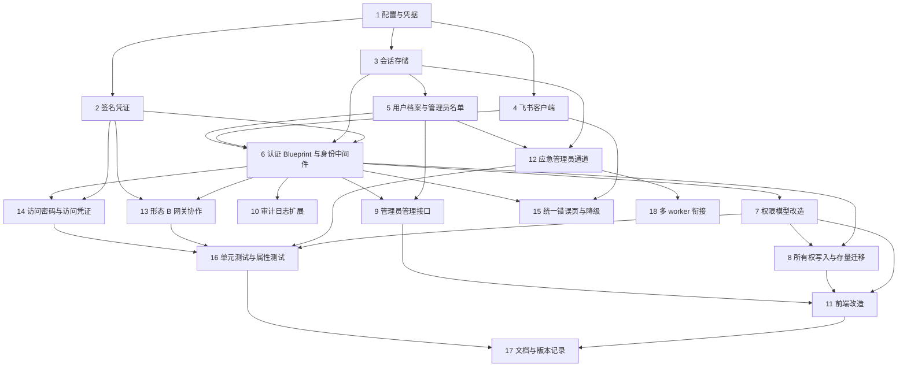

# Implementation Plan

## Overview

任务顺序按「形态 A 尽早可端到端验证」编排。任务 1~6 完成后，本地 8080 就能用你自己的飞书账号扫码登录；任务 7~11 完成后完整的身份与权限链路可用；形态 B（Nginx 双域名 + HTTPS）集中在任务 13，可延后到阶段三部署时再启用。

**关键顺序约束**：权限收紧（任务 7）会让 41 个存量项目对普通员工不可编辑，因此「批量指定负责人」的接口与界面（任务 8.3、任务 11.3）必须与任务 7 同批交付，不得先上线任务 7。

**破坏性变更提醒**：任务 9 会移除现有的 `/api/admin/login` 等五个路由，任务 11.2 会移除对应的前端抽屉，两者必须同批发布。任务 7.3 之后匿名上传不再可用，所有操作都需要先登录。

## Task Dependency Graph



关键路径为 `1 → 3 → 5 → 6 → 7 → 8 → 11`。任务 12、13、14 相互独立，可并行。任务 13 是形态 B 的全部内容，不阻塞形态 A 的验证。

```json
{
  "waves": [
    { "wave": 1, "tasks": ["1"], "description": "配置与凭据基础设施，所有后续任务的前置" },
    { "wave": 2, "tasks": ["2", "3", "4"], "description": "签名工具、会话存储、飞书客户端，三者互不依赖可并行" },
    { "wave": 3, "tasks": ["5"], "description": "用户档案与管理员名单，依赖会话存储" },
    { "wave": 4, "tasks": ["6"], "description": "认证 Blueprint 与身份中间件，完成后形态 A 可端到端扫码登录" },
    { "wave": 5, "tasks": ["7", "9", "10", "12", "13", "14", "15"], "description": "权限模型、管理员接口、审计扩展、应急通道、网关协作、访问凭证、错误页，均只依赖任务 6，可并行" },
    { "wave": 6, "tasks": ["8", "18"], "description": "所有权写入与存量迁移（依赖权限模型）、多 worker 衔接（依赖应急通道）" },
    { "wave": 7, "tasks": ["11"], "description": "前端改造，依赖权限模型、所有权字段与管理员接口" },
    { "wave": 8, "tasks": ["16"], "description": "单元测试与属性测试，覆盖前面全部实现" },
    { "wave": 9, "tasks": ["17"], "description": "文档同步与版本记录，收尾" }
  ]
}
```

## Tasks

- [x] 1. 搭建配置与凭据基础设施
  - 在 `server/config.py` 新增配置项：`AUTH_MODE`（`embedded` / `gateway`，默认 `embedded`，非法值启动终止）、`TRUSTED_GATEWAY_IPS`、`ADMIN_ORIGIN`、`PREVIEW_ORIGIN`、`EMERGENCY_BIND`、`PREVIEW_SANDBOX`、`FEISHU_APP_ID`、`FEISHU_APP_SECRET`、`AUTH_SIGNING_SECRET`、`DEPLOY_ENV`
  - 实现 `.env` 读取（标准库解析，不引入 python-dotenv），环境变量优先于 `.env`
  - 启动校验：`FEISHU_APP_ID` / `FEISHU_APP_SECRET` 缺失或空白则终止进程且不监听端口，错误信息只报变量名不带取值
  - 创建 `.env.example`，飞书凭据字段填占位符
  - _Requirements: 12.1, 12.2, 12.3, 12.4_

- [ ] 2. 实现签名凭证工具
  - 新建 `server/auth/signing.py`：`sign(payload: dict) -> str` 与 `verify(token: str, expected_typ: str) -> dict | None`，格式为 `b64u(json).b64u(hmac_sha256)`，校验用 `hmac.compare_digest()`
  - 签名密钥解析：`AUTH_SIGNING_SECRET` 优先；`embedded` 模式缺失时自动生成 32 字节随机值持久化到 `BASE_DIR/.auth_secret`（权限 0600）；`gateway` 模式缺失则启动终止
  - 把 `.auth_secret` 加入 `.gitignore`
  - _Requirements: 4.8, 12.2, 14.6_

- [ ] 3. 实现会话存储
  - 新建 `server/auth/session_store.py`，用 `AtomicJSONStore` 包装 `BASE_DIR/auth_sessions.json`，容器为 `sessions` / `states` / `handoffs` / `emergency_failures`
  - 会话记录字段：`user_id`、`name`、`domain`（`admin`/`preview`）、`kind`（`feishu`/`emergency`）、`created_at`、`last_seen_at`、`expires_at`，时间统一 UTC 秒级整数，`expires_at = created_at + 2592000`
  - 实现 `create_session()`（256 位熵标识）、`get_valid_session()`、`touch()`（活跃时间 5 分钟节流，300 秒内不落盘）、`delete_session()`（按域删除，幂等）
  - 过期判定按严格大于：空闲 `> 604800` 秒、当前时间 `>` 绝对过期时间才算过期
  - 实现 `state` 与 `handoff` 的写入、一次性消费、过期清理
  - 启动钩子：清理过期记录并原子写回；文件损坏时从备份恢复，无备份则空集合启动 + 审计，不终止进程
  - _Requirements: 3.1, 3.2, 3.3, 3.4, 3.5, 3.6, 3.7, 3.8, 3.9, 3.10, 3.14, 3.15, 3.16_

- [ ] 4. 实现飞书开放平台客户端
  - 新建 `server/auth/feishu.py`，用 `urllib.request` + `ssl.create_default_context()` 实现，`timeout=5`，同一授权流程内不重试
  - 实现 `exchange_user_token(code, redirect_uri)`、`get_user_info(token)`、`is_app_admin(token, user_id)`
  - 统一异常 `FeishuError(code, msg)`，异常信息与日志中不出现 App Secret、`access_token`、授权码
  - 不新增 `requirements.txt` 依赖
  - _Requirements: 1.3, 1.6, 1.11, 1.12, 8.2, 12.5, 12.6, 12.7, 13.1, 13.5_

- [ ] 5. 实现用户档案与管理员名单
  - 新建 `server/user_directory.py`，读写 `metadata.json` 中的 `_system_users_` 与 `_system_admin_list_`
  - 用户档案：`upsert_user(user_id, name)` 记录首次登录时间、更新姓名与最后登录时间，姓名截断到 64 字符
  - 管理员名单：`get_admin(user_id)`、`add_admin()`、`remove_admin()`、`count_super()`，级别取 `super` / `normal`，名单上限 100 条
  - 首个超管 bootstrap：名单为空时在一次 `transaction()` 内写入，保证并发下只产生一个超管条目
  - 明确 `_system_admins_` 不参与飞书登录路径的管理员判定
  - _Requirements: 1.6, 1.7, 1.8, 5.9, 5.10, 8.1, 8.2, 8.3, 8.5, 8.14_

- [ ] 6. 实现认证 Blueprint 与身份中间件（形态 A 可端到端验证）
- [ ] 6.1 认证路由
  - 新建 `server/auth/__init__.py`，注册 `GET /auth/login`、`GET /auth/feishu/callback`、`POST /auth/logout`、`GET /auth/health`
  - `/auth/login`：已有有效会话则按回跳规则 302；否则生成 128 位熵 `state`（含 `return_to`、`redirect_uri`、10 分钟过期）后 302 到飞书授权页
  - `/auth/feishu/callback`：`state` 四类失败（缺失/无记录/过期/已用）统一 400 + 审计；先标记 `state` 已用再换令牌；取用户信息后写档案、签发会话、按回跳规则 302
  - 回跳白名单：仅接受以单个 `/` 开头的站内相对路径，或主机名等于管理域/预览域；否则回管理域首页
  - 会话 Cookie：`HttpOnly`、`SameSite=Lax`、`Path=/`、`Domain` 为完整主机名不设父域；`DEPLOY_ENV=production` 时追加 `Secure`
  - _Requirements: 1.1, 1.2, 1.3, 1.4, 1.5, 1.9, 1.10, 1.13, 1.14, 1.15, 3.10, 3.11, 3.12, 3.13_
- [ ] 6.2 身份解析中间件
  - 新建 `server/auth/identity.py`，`before_request` 钩子把身份写入 `flask.g.actor`
  - `embedded` 模式：无条件剥离并忽略所有 `X-Auth-*` / `X_Auth_*` 头（不区分大小写），身份只从会话 Cookie 解析
  - `gateway` 模式：先校验 `request.remote_addr` 属于 `TRUSTED_GATEWAY_IPS`，不属于则 403 且不采信任何 `X-Auth-*`；通过后只读 `X-Auth-User-Id`
  - `X-Auth-User-Id` 格式校验：1~64 位 `[A-Za-z0-9_-]`；缺失/为空/格式非法且非应急通道来源则 401 且不执行写操作
  - `X-Auth-User-Name` 百分号解码失败时回退用 UserID 作展示名，不阻断请求
  - 未认证时按 `Accept` 分流：含 `text/html` 则 302 到登录入口并带回跳参数（超 2048 字节则不带），否则 401 且响应体不含受保护内容
  - 移除 `X-Admin-Token` 的一切认证能力
  - _Requirements: 2.4, 2.5, 2.6, 2.7, 2.9, 2.10, 2.11, 2.12, 2.13, 2.14, 2.15, 7.7_
- [ ] 6.3 集成到 create_app 并接首个超管授予
  - 在 `create_app()` 中注册 Blueprint 与 `before_request`，`/auth/*` 与健康检查排除在认证要求之外
  - 名单为空时调用飞书校验应用管理员并授予超管；接口超时/失败/返回假则完成登录、按普通员工处理并写审计
  - 名单非空时不再调用该飞书接口
  - _Requirements: 2.2, 8.2, 8.3, 8.4, 8.5_

- [ ] 7. 改造权限模型
- [ ] 7.1 实现 can_manage
  - 新建 `server/permissions.py`，定义 `Actor` 数据类与 `can_manage(project_meta, actor)`
  - 判定式：管理员（超管与普通管理员一视同仁）恒真；否则 `owner_id` 非空且等于 `actor.user_id` 才为真；无负责人项目对非管理员恒假
  - `uploader_ip` 不作为任何输入
  - _Requirements: 5.6, 5.8, 7.1, 7.2, 7.3_
- [ ] 7.2 改造 file_manager 接口
  - `delete_file`、`restore_version_file`、`delete_version_file` 的 `request_ip` / `is_admin` 参数改为由调用方传入的 `allowed: bool` 与 `actor`
  - 删除 `can_delete()`，清理其全部调用点
  - _Requirements: 5.6, 7.4_
- [ ] 7.3 路由接入权限校验
  - 编辑项目信息、设置项目访问密码、上传新版本、恢复历史版本、删除历史版本、删除项目六类操作，每次请求依据 `g.actor` 与目标项目重新计算 `canManage`，不采纳请求体中任何权限字段
  - 为假时返回 403，且元数据条目、当前版本文件、历史版本归档均保持原状
  - 上传新项目（目标标识尚不存在）跳过 `canManage` 校验，但要求已认证
  - 项目列表响应改为返回 `canManage`、`ownerId`、`ownerName`，移除 `canDelete`
  - 项目列表 / 版本历史 / 预览历史版本对任意已认证用户开放，未认证返回 401 且不返回任何项目数据
  - _Requirements: 7.4, 7.5, 7.6, 7.7, 7.10, 7.11_

- [ ] 8. 实现所有权写入与存量迁移
- [ ] 8.1 上传路径写入负责人
  - 新建项目时写 `owner_id` / `owner_name`（取自会话）；新增版本时在版本记录写 UserID 与姓名快照，且不改动项目级 `owner_id`
  - 会话缺 UserID 或姓名时拒绝上传，不落任何文件与元数据，提示重新登录
  - 继续写入 `uploader_ip`，用途收窄为审计展示
  - 读取时 `owner_id` 缺失或为空一律视为无负责人；展示名优先取用户档案，查不到则用 `owner_name` 快照
  - _Requirements: 5.1, 5.2, 5.3, 5.4, 5.5, 5.7, 5.9, 5.10, 5.11_
- [ ] 8.2 迁移脚本
  - 新建 `server/migrate_identity.py`：显式留一份带时间戳的 `metadata.json` 副本，在单个 `transaction()` 内补齐字段
  - 幂等：已有非空 `owner_id` / `owner_name` 不覆盖；重复执行结果逐字段一致
  - 保全所有既有字段，含 41 个存量项目的项目级 `uploader_ip` 与 67 个归档的版本级 `uploader_ip`
  - 建立 `_system_users_` 与 `_system_admin_list_` 空容器
  - 失败时不提交，文件保持原内容；结束时输出项目总数与待指定负责人数量
  - _Requirements: 5.12, 5.13, 5.14, 5.15, 5.16_
- [ ] 8.3 批量指定负责人接口
  - 新增 `POST /api/projects/owner`，接受项目标识数组与目标 UserID
  - 校验顺序固定为 权限(403) → 参数(400) → 项目存在性(404)；重复标识去重；单次上限 100 个，为 0 或超限返回 400
  - 目标 UserID 必须存在于用户档案，否则 400 并说明该员工需先登录一次
  - 任一项目标识不存在则 404 且不修改该请求中任何项目
  - 成功时逐项目写审计（含操作者、项目标识、旧负责人、新负责人）
  - 新增 `GET /api/users` 返回用户档案列表供选人
  - _Requirements: 6.1, 6.2, 6.3, 6.4, 6.5, 6.6, 6.7, 6.8, 6.9, 6.10, 6.11_

- [ ] 9. 改造管理员管理接口
  - `GET /api/admins` 返回以 UserID 为主键的名单（含姓名、级别、创建时间）
  - `POST /api/admins` 从用户档案添加普通管理员；目标不在档案则 400 并说明需先登录
  - `DELETE /api/admins/<user_id>`：不在名单返回 404；移除自己返回 400；会使超管数量降为 0 返回 400
  - 非超管对这两个写接口一律 403 且不修改名单
  - 成功时写审计（操作者、目标、操作类型、变更前后级别）
  - 被移出名单的用户保留会话，自下一次请求起按普通员工计算 `canManage`
  - 移除 `/api/admin/login`、`/api/admin/logout`、`/api/admin/setup`、`/api/admin/status`、`/api/admin/password` 五个路由
  - _Requirements: 8.6, 8.7, 8.8, 8.9, 8.10, 8.11, 8.12, 8.13_

- [ ] 10. 扩展审计日志
  - `audit.log()` 新增 `actor_id` 与 `actor_name` 字段（各截断到 64 字符），飞书用户写 UserID，应急通道写 `emergency:` 前缀标识
  - 项目级访问事件写访问者 UserID 与姓名；无法确定身份时 `actor_id` 写 `anonymous`、`actor_name` 写空字符串，`ip` 仍写来源 IP
  - 保留原 `actor` 字段（取 `actor_name`，为空时取 IP），使既有查询与展示不受影响
  - `ip` 字段无法获取时写空字符串而非省略
  - 查询侧支持 `actor_id` 精确筛选（区分大小写、不做子串匹配），缺该字段的历史记录排除在筛选结果外
  - 读取缺字段的历史记录时按空字符串返回，不丢弃不报错
  - 写入内容过滤 App Secret、`access_token`、授权码、会话标识
  - 日志写入失败不中断业务请求
  - _Requirements: 10.1, 10.2, 10.3, 10.4, 10.5, 10.6, 10.7, 10.8, 10.9, 10.10, 10.11_

- [ ] 11. 前端改造
- [ ] 11.1 凭据与请求层
  - `api.ts` 移除 `authHeaders()` 与 `X-Admin-Token`，所有请求（含 `postFileWithProgress` 的 XHR）改为携带 Cookie、设置 `credentials: 'same-origin'` 与 `xhr.withCredentials`
  - 401 统一处理：清除本地登录态并在 1 秒内跳转登录入口，同一页面生命周期内多个 401 只跳一次
  - 应用加载时清除 localStorage 中遗留的管理员 Token 键
  - 新增 `getMe()` 调用 `/api/me`
  - _Requirements: 11.1, 11.2, 11.3, 11.7, 11.11_
- [ ] 11.2 登录态与按人筛选
  - 导航栏展示当前登录用户姓名与登出入口；登出请求后端结束会话再跳登录入口
  - 侧边栏「上传者」改为「负责人」，按 `owner_id` 分组，标签用姓名并展示数量，姓名超 20 字符省略号截断
  - `owner_id` 为空归入「未指定负责人」分组并排在最后
  - 点击分组筛选，再次点击同一分组取消筛选
  - 项目卡片展示负责人姓名（无则显示「未指定负责人」），移除 IP 展示
  - 所有操作入口由 `canManage` 驱动（替换 `canDelete`）
  - 移除管理员登录抽屉、首个管理员创建抽屉、修改密码抽屉
  - _Requirements: 11.4, 11.5, 11.6, 11.8, 11.9, 11.10, 7.8_
- [ ] 11.3 指定负责人界面
  - 「未指定负责人」筛选下提供多选与批量指定负责人的入口（仅超管可见）
  - 负责人候选列表来自 `GET /api/users`
  - 管理员管理抽屉改为按 UserID 从用户档案添加/移除，非超管隐藏入口
  - _Requirements: 6.12, 8.9_

- [ ] 12. 实现应急管理员通道
  - 新建 `server/auth/emergency.py`，在后台线程起独立 werkzeug 服务实例绑定 `EMERGENCY_BIND`（默认 `127.0.0.1:8099`）
  - 启动前校验绑定地址为回环（`127.0.0.1` / `::1` / `localhost`），否则拒绝启动整个进程并输出违规说明
  - 请求进入后二次校验 `remote_addr` 为回环，否则不校验凭据直接 403 + 审计
  - 密码策略：16~128 字符且四类字符至少三类，bcrypt 存储，沿用 `_system_admins_`；不满足则拒绝设置并保持原密码
  - 失败限流：15 分钟滑动窗口 5 次失败 → 自第 5 次起 15 分钟内一律 429（凭据正确也拒绝），成功后归零，计数持久化
  - 签发 `kind=emergency` 会话，60 分钟固定有效期不续期，满 60 分钟后失效并要求重新登录
  - 会话有效期内授予超级管理员权限
  - 每次登录处理写审计（时间、账号、来源地址、结果四类），不含密码明文
  - _Requirements: 9.1, 9.2, 9.4, 9.5, 9.6, 9.7, 9.8, 9.9, 9.10, 9.11, 9.12_

- [ ] 13. 实现形态 B 的网关协作与域隔离
- [ ] 13.1 校验端点与跳转流程
  - 新增 `GET /auth/verify`：200 时回 `X-Auth-User-Id` 与 `X-Auth-User-Name` 响应头，姓名先 UTF-8 再百分号编码、不超过 256 字节且按完整编码序列截断
  - 新增 `GET /auth/handoff`（管理域签发 60 秒一次性跳转凭证，`jti` 落库）与 `GET /auth/preview-entry`（预览域消费凭证后签发独立会话并立即失效该凭证）
  - 跳转凭证签名失败/过期/已用 → 不签发会话并 302 回管理域登录入口
  - 会话所属域与请求域不一致时 401 且不刷新活跃时间
  - 管理域与预览域使用不同 Cookie 名与不同会话记录
  - _Requirements: 2.6, 2.8, 2.11, 4.6, 4.7, 4.8, 4.9, 4.10, 4.11_
- [ ] 13.2 预览域 URL 与沙箱降级
  - 项目列表响应的访问链接改为绝对 URL，主机名取自 `PREVIEW_ORIGIN` 配置而非请求 `Host` 头
  - `embedded` 模式下对 `/files/*`、`/protected/*`、`/versions/*` 响应加 `Content-Security-Policy: sandbox allow-scripts allow-forms allow-popups`，由 `PREVIEW_SANDBOX` 开关控制
  - _Requirements: 4.12_
- [ ] 13.3 Nginx 配置样例
  - 新建 `deploy/nginx.conf.example`：`underscores_in_headers off`、`proxy_set_header X-Auth-* ""` 头清洗、`auth_request` 内部端点、2 秒超时与非 200/401 一律 503 的 fail-closed
  - 管理域：仅提供管理界面与 `/api/*`，`/files|versions|protected/` 返回 404，`/api/*` 不设允许预览域来源的跨域头
  - 预览域：仅代理 `/files|versions|protected|auth/`，`/api/*` 返回 403，非 GET/HEAD 返回 405，其余路径 404，响应加 `X-Content-Type-Options: nosniff`
  - 应急通道端口排除在代理之外
  - _Requirements: 2.1, 2.2, 2.3, 2.4, 2.5, 2.6, 2.7, 4.1, 4.2, 4.3, 4.4, 4.5, 4.13, 9.3_

- [ ] 14. 改造项目访问密码与访问凭证
  - 密码校验入口仅在管理域提供，密码明文出现范围限定为该次请求体与进程内存，单次接受长度上限 128 字符
  - 校验通过签发 8 小时有效的无状态访问凭证，payload 含 UserID、项目标识、密码版本 `pv`（取当前 bcrypt 哈希前 12 字符）
  - 预览域校验四项条件：签名有效、未过期、凭证内 UserID 与当前预览域会话一致、项目标识一致
  - 未携带凭证或凭证无效 → 401、不返回内容任何字节、响应中给出管理域密码校验入口链接，且预览域不提供密码提交入口
  - 密码修改或移除后此前签发的凭证在下一次校验即失效
  - 密码错误返回 401 + 审计；同一 UserID 对同一项目 15 分钟 5 次失败 → 15 分钟内 429
  - 移除 `_access_tokens` 进程内字典与一年期 Cookie 逻辑
  - _Requirements: 14.1, 14.2, 14.3, 14.4, 14.5, 14.6, 14.7, 14.8, 14.9_

- [ ] 15. 统一错误页与降级行为
  - 实现统一错误页模板，不回显飞书原始响应内容，不暴露应急管理员通道路径，仅呈现失败原因分类
  - 飞书超时（5 秒）→ 含「重新发起授权」入口；授权码无效或已使用 → 含「重新登录」入口并保持原有会话 Cookie 与记录不变
  - 校验端点对会话的校验不发起任何飞书请求，保证飞书不可用时既有会话继续可用
  - 授权流程失败写审计（失败时间、所处环节、来源 IP、飞书错误码），不含任何凭据
  - _Requirements: 13.1, 13.2, 13.3, 13.4, 13.5, 13.6_

- [ ] 16. 编写单元测试与属性测试
- [ ] 16.1 单元测试
  - 新建 `server/tests/`，配置 pytest
  - 签名凭证：篡改 payload、篡改签名、过期、`pv` 变更后失效
  - 会话过期边界：空闲等于 604800 秒有效、大于无效；当前时间等于绝对过期时间有效、大于无效
  - `state` 一次性：同一 `state` 第二次回调返回 400
  - 应急通道：非回环来源 403、限流窗口行为、60 分钟不续期
  - _Requirements: 3.8, 3.9, 1.4, 9.2, 9.6, 9.8_
- [ ] 16.2 属性测试
  - Property 1 伪造身份头无效：随机生成 `X-Auth-*` / `X_Auth_*` 头组合（含大小写变体），两种模式下身份判定结果均不受影响
  - Property 2 权限判定等价式与 Property 3 IP 无关性：随机项目与操作者组合验证真值表，随机改动 `uploader_ip` 结果不变
  - Property 4 迁移幂等与字段保全：随机生成 `metadata.json` 结构，验证两次迁移结果一致且非 `owner_*` 字段全部保留
  - Property 5 一次性凭证：并发重放 `state` 与跳转凭证，最多一次签发
  - Property 6 与 Property 7 会话有效性单调递减与边界闭合
  - Property 8 访问凭证与密码强绑定
  - Property 9 凭据不外泄：扫描响应体、响应头、日志、审计记录中不出现 Secret / token / code / 会话标识
  - Property 10 域会话不互通
  - Property 11 失败请求不留痕：对随机的 4xx/5xx 写请求，比对 `metadata.json`、`webapps/`、`versions/` 前后一致
  - _Requirements: 2.7, 2.9, 5.6, 5.8, 5.14, 5.15, 7.1, 7.2, 7.3, 7.5, 10.10, 12.5, 14.9, 4.11_
- [ ] 16.3 安全回归清单
  - 编写可重复执行的脚本，覆盖：伪造身份头、绕过网关直连、`X-Admin-Token` 已失效、预览域拒 `/api/*` 与非 GET/HEAD、管理域拒 `/files/*`、跳转凭证重放
  - _Requirements: 2.9, 2.15, 4.3, 4.4, 4.5, 4.10_

- [ ] 17. 同步文档与版本记录
  - 更新 `PRD.md` 2.8 节权限矩阵，覆盖项目负责人、普通管理员、超级管理员、其他已认证用户四类角色在六类管理操作与三类读取操作上的判定结果
  - 更新 `PRD.md` 的技术架构、API 清单、数据结构、部署说明章节；移除文档中的默认超管密码
  - `README.md` 补充飞书应用配置步骤与环境变量说明
  - 执行 `python3 server/changelog.py "<摘要>" security` 记录版本
  - _Requirements: 7.9_

- [ ] 18. 处理多 worker 部署的衔接点
  - 应急通道后台线程在多 worker 下会各起一份，改为仅主 worker 启动或独立进程运行，并在 `deploy/` 说明中记录
  - 复核会话存储的跨进程文件锁在多 worker 下的正确性
  - _Requirements: 9.1, 3.1_

## Notes

### 不在本任务列表内的事项

- **阶段一的独立加固**：`X-Forwarded-For` 可信代理解析、登录接口限流、gunicorn 切换。这三项作为常规改动单独完成。其中 `X-Forwarded-For` 改造在形态 B 上线前必须完成，否则审计日志里的来源 IP 仍可被伪造。
- **阶段三的部署实施**：服务器迁移到 Linux、HTTPS 证书签发、生产数据迁移、域名备案与 DNS 解析。任务 13.3 只交付 Nginx 配置样例，不含实际部署动作。
- **飞书侧的管理员动作**：权限审批、应用版本发布、可用范围设置。这些需要企业管理员操作，不是编码任务。在此之前只有已加入测试名单的账号能登录，足够完成任务 1~16 的全部验证。

### 验证顺序建议

任务 6 完成时立刻做一次端到端验证（本地扫码登录 → 确认建档 → 确认自动成为超管），把飞书对接的不确定性尽早消掉。不要等到任务 11 前端改完才第一次联调。

### 依赖清单约束

全程不得新增第三方依赖，`requirements.txt` 保持 `flask` 与 `bcrypt` 两项。飞书 HTTPS 调用用标准库 `urllib`，签名用 `hmac` + `hashlib`，测试框架 pytest 属于开发依赖，单独列在 `requirements-dev.txt`。
